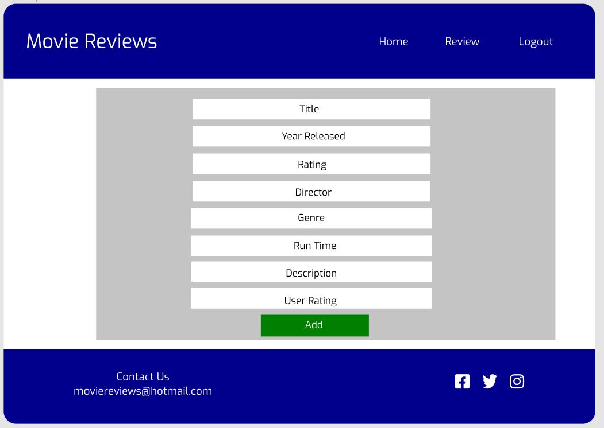
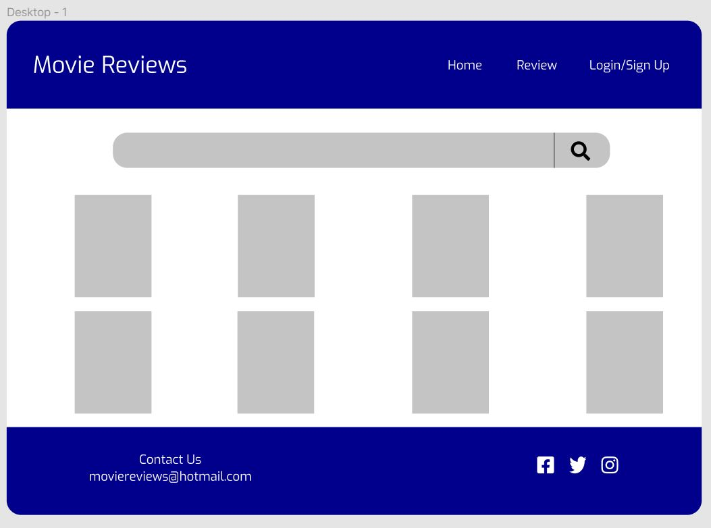
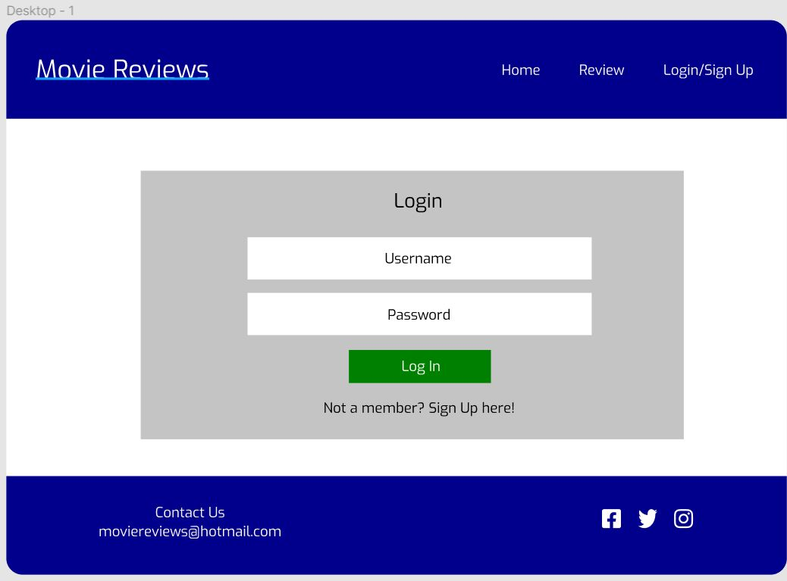
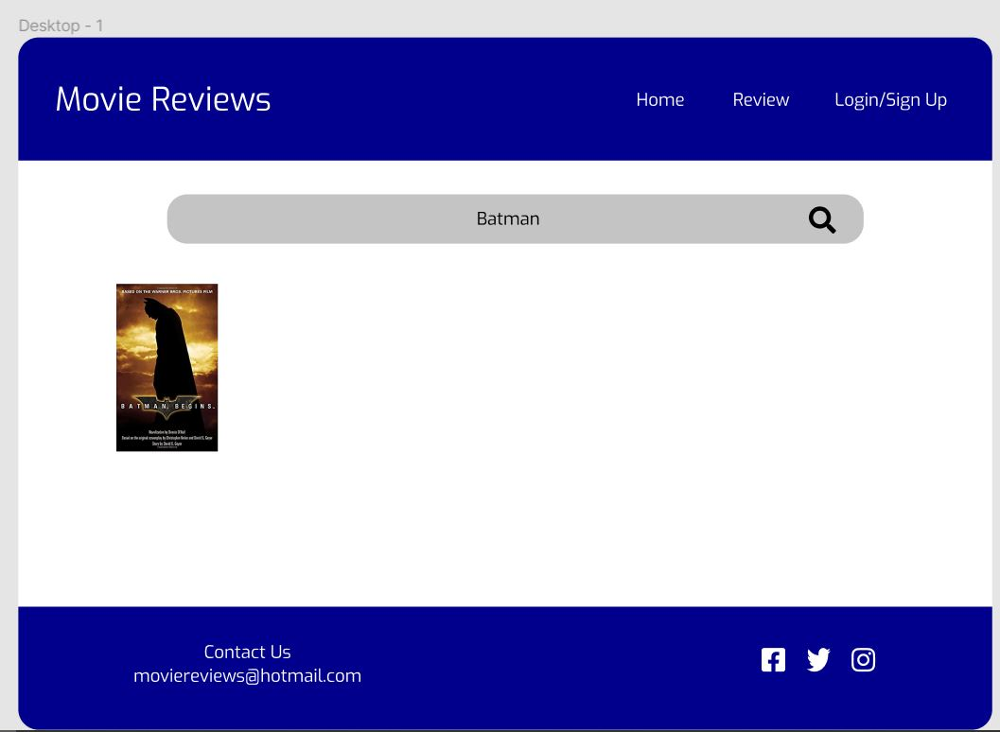
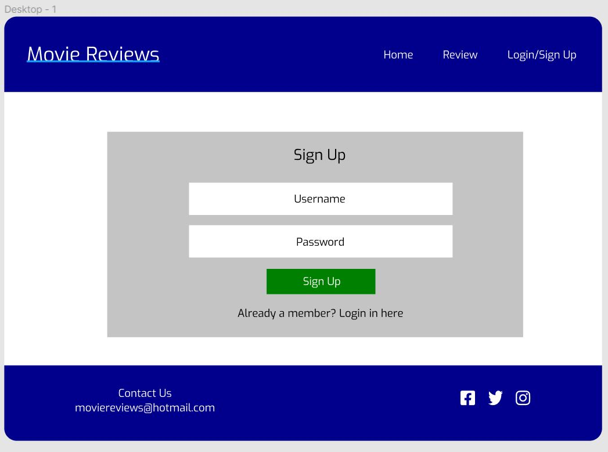
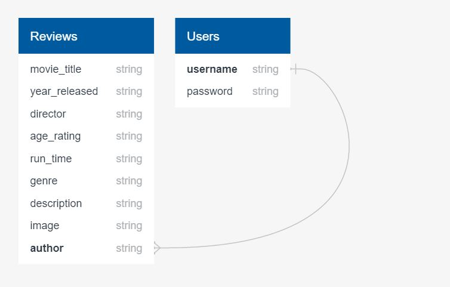
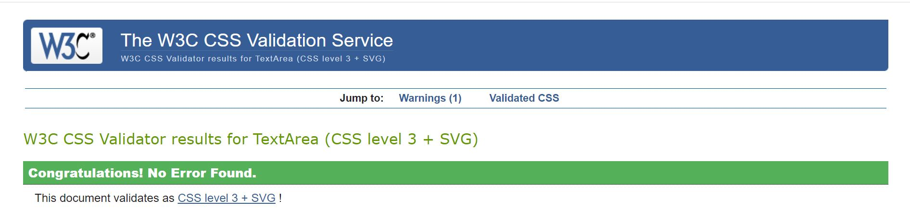
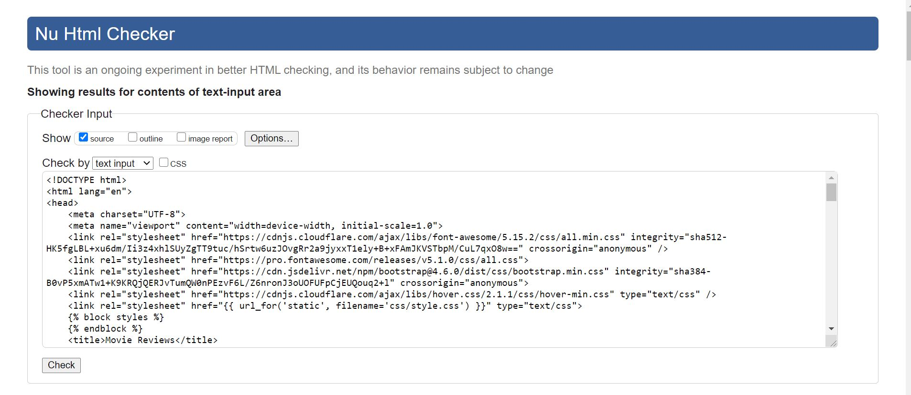

# Milestone Project 3

Live link to my website: https://ms3-movie-reviews.herokuapp.com/

This is my third project for Code Institute. I have created a movie reviews website which allows users to add their own reviews on movies they have seen. They are also able to view reviews added by other users.

The landing page consists of a search bar which allows users to search movies by name, genre and the year it was released. Also, on the landing page are all the other reviews which have been added on to the website. We have a login page which allows registered users to login into the website. Once their details are in the table, this will allow users to login to the website. Once the user is logged in, the logout feature will appear in the navigation bar. The reason for this is because we don’t the logout feature to be in the navigation bar all the time, we only want it to appear once a user is logged in. Another feature that only appears when a user is logged in, is the add review feature. Once clicked, it will lead the user to the add review page. Once they have added the review, the data will automatically be inputted into the database and will appear on the landing page with the other reviews.

## UX

This project is for anyone with a love of movies. Users can create, read, update and delete reviews.

### User Stories

* As a movie critic I want to be able to add a new review about a movie. I also want to be able to update or delete my review if necessary. 
* As a person who watches movies, I want to be able to read reviews about upcoming movies.  
* As a person who is involved in the production of movies, I want to be able to see what other people think of the movie I have worked on. 

### Wireframes

<h5 align="center"></h5>
<h5 align="center"></h5>
<h5 align="center"></h5>
<h5 align="center"></h5>
<h5 align="center"></h5>

### Database

<h5 align="center"></h5>

## Features 

Navbar – The navbar appears at the top of the screen and all the page links are working. There is a login feature for existing members to sign into the website to add a review. There is also a sign up feature which allows non members to sign up to the website. We also have an add reviews feature, this is only available to users when they have logged into the website. The navbar isn’t fixed to the top of the screen so users will have to scroll back to the top of the screen if they want to use the navbar. When the website is viewed on smaller screen sizes, the navbar should turn into a drop-down list which it does. I tested the navbar on different screen sizes and it worked perfectly on every single one. 

Footer – The Footer appears at the bottom of each page. The social media links are all working, and it leads to my social media pages. In the footer, we also have an email address, this allows users to contact the creator of the page if they have any issues or questions. When the website is viewed on smaller screen sizes, the contents of the footer all stack up on each other and is centred. Similar to the navbar, the footer isn’t fixed to the bottom of the screen, so the users have to scroll back down to the bottom of the screen to view the footer contents. 

Forms - In this site, there are 4 forms. There is a form to add a review, edit a review as well as the sign-up and login pages. The forms to add a review, edit a review and the login form are all linked to the datebase. When the users completes the form to add a review, the data entered will be pushed to the database and that information will be displayed on the home page. This is similar to the edit review form. The user can edit a review, and the updated review will appear on the home screen. There is also a sign-up form which allows users who are not registered to become a registered user. Once a user signs up, their username will be inputted into the database in the users table. Their password will be logged in the database, however using the Werkzeug security feature, their password will not be shown.

Buttons - There are many buttons used in the site. On the home page, there are 2 buttons. The first button is a search button, which allows users to search the database for movies. The second one is a reset button. This is used when the user has searched for a movie and want to return to the home page. On the individual movie reviews page, users have the option to delete or edit a review. However this function is only limited to the user who has created that review.

### Colours

The pages follow a standard colour scheme with only a few colours being used throughout the whole sight, the colours that were used are listed below:
* #00008B - Blue
* #FFFFFF - White

### Font

Throughout the website, I decided to use 1 font as I thought I would look better than having 2 -3 different fonts. The font I used was Exo as I believed It looked the best out of all the fonts. 

## Technologies Used

* [HTML5](https://en.wikipedia.org/wiki/HTML5) – HTML was used to create the basic structure of the website.
* [CSS3](https://en.wikipedia.org/wiki/CSS) – I used CSS to style the pages of the website.
* [Google Fonts](https://fonts.google.com/) – Provided me with the font I used throughout the pages.
* [Bootstrap](https://getbootstrap.com/) – I used v4.6 of bootstrap to add columns and rows to the pages to provide some sort of structure. It also allowed me to make the pages responsive  for smaller screen sizes. 
* [jQuery](https://jquery.com/) - The project uses JQuery to simplify DOM manipulation.
* [GitHub](https://github.com/) – I used GitHub to create the repository
* [Git](https://en.wikipedia.org/wiki/Git) -  Used for version control as well as storing any changes I made to the code. 
* [Gitpod](https://www.gitpod.io/) -  This was the IDE I used for the project
* [Heroku](https://www.heroku.com/) - Heroku was used to host the app
* [MongoDB](https://www.mongodb.com/) - Database that was used in the project
* [Flask](https://flask.palletsprojects.com/en/1.1.x/) - Framework used to help build the site
* [Werkzeug](https://werkzeug.palletsprojects.com/en/1.0.x/) - Used for user authentication, the login, sign - up and logout features
* [Jinja](https://jinja.palletsprojects.com/en/2.11.x/) - Templating language to help builf the site
* [Figma](https://www.figma.com/) – Used to create the wireframes which provided me with the basic design of the website. 
* [W3C Markup Validation Service](https://validator.w3.org/) – I used this to validate my HTML to see if there were any errors in my HTML. 
* [W3C CSS Validation Service](https://jigsaw.w3.org/css-validator/) - I used this to validate my CSS to see if there were any errors in my CSS.

## Testing 

Navbar – The navbar appears at the top of the screen and all the page links are working. When the login link is clicked it leads to the login page, this is the same with the sign up link, when clicked it leads users to a sign up page. I tested the navbar on different screen sizes and it worked perfectly on every single one. 

Footer – The Footer appears at the bottom of each page. The social media links are all working, and it leads to my social media pages. Similar to the navbar, the footer isn’t fixed to the bottom of the screen so the users have to scroll back down to the bottom of the screen to view the footer contents.

Login / Sign Up Form - To test these fetaures, I signed up to the website. As expected, there were no issues. My username was stored in the database, along with a hashed version of my password, meaning I couldnt see the actual password I had typed in. 

Logout - The last of the user authentication features, was the logout function. This worked as expected, the user is able to logout of the site. When the user is logged out, they are unable to add a new review. They can only view them. 

Add Review Form – To test the form, I entered data into all the field, the result of this was that all the data that was entered, appeared in the MongoDB database as expected. 

Buttons - To test the buttons, I clicked each one to see if they perfomed the correct action. I typed a movie in the search bar and clicked the search button. Once clicked, the movie which I searched for appeared on the screen. I then clicked the reset button, once clicked, all the other movies re-appeared on the homepage. The next button I tested was the add review button. Once clicked, this led me to a form in which I can add another review. To test the edit review button, I again clicked on the button and this led me to another form in which I could edit a review. Finally, the last button was the delete button. When I clicked this button the review that I was on was deleted from the database and the homepage. 

### Testing Tools 

I used the following validation services to validate my code:

* W3C Markup Validation Service 
* W3C CSS Validation Service

Both my CSS and HTML passed the validation service without any errors

<h4 align="center"></h4>
<h4 align="center"></h4>

### Testing Methods 

I used the following devices to test my website on smaller screen sizes:

* Samsung S20
* iPad Pro
* Samsung S10

I then used the developer tools on Google Chrome to test the website on different devices. The devices I tested the site on are as follows:

* iPhone X
* iPad
* Moto G4

## Deployment

I deployed my project through Heroku. 

How to run this project locally to clone this project from GitHub:

* Firstly, you need to go to github and search for the repository. Once found, then click "Clone or download".
* In the Clone with HTTPs section, copy the clone URL for the repository.
* Then in your local IDE open Git Bash.
* After this, you should change the current working directory to the location where you want the cloned directory to
* In the terminal type in git clone. You should then paste in the URL
* Once you have clicked Enter, your local clone will be ready.

How to deploy your project on Heroku: 

* Firstly, go onto the Heroku website and sign in.
* Then click on the create new app option and choose your region.
* You must make sure that your project has both a Procfile and a requirements.txt file otherwise your app will not run.
* Find the deployment section in your Heroku app and then make sure you select Github for automatic deployment. This will ensure that whenever you push your work to github, the app will automatically be deployed to Heroku.
* After this, you need to select your github user and find the repository.
* Then enter the necessary convig vars and click deploy branch. Once the app is ready, click view app, this will open the app in a new tab.
* Finally, every time you push your work in gitpod, the heroku will automatically build the app.

## Credits

### Content 

* The fonts were used from Google Fonts
* The navbar and form elements were used from bootstrap

### Media

* The images are all free to use images. 

### Acknowledgments 

* The inspiration behind this project was loosely based on the backend development mini project that I created while completing the backend development module.
* I received advice from my mentor Aaron Sinnott
* I also received help from the Code Institute tutoring team who helped me when I had errors which I could not fix myself
